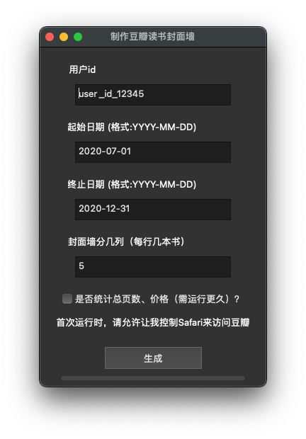

# DoubanBookCovers

制作豆瓣读书封面墙，并展示简单的统计数据。

# Download

下载链接：[Mac](https://github.com/astroboylrx/DoubanBookCovers/releases/download/v1.2/DoubanBookCovers-Mac.app.zip)
下载链接：[Windows](https://github.com/astroboylrx/DoubanBookCovers/releases/download/v1.2/DoubanBookCovers-Windows.zip)

# Usage

用户界面如下

用户id在你的豆瓣个人主页网址中，在people后面：https://www.douban.com/people/user_id_here/

## 封面墙

点击生成按钮，程序在获取数据后回弹出保存图片对话框。图片示例如下（29本书）

## 统计结果

保存封面墙之后，会弹出保存月度阅读统计图片的对话框。图片示例如下

最后会显示总页数，估计的价格和评分分布

