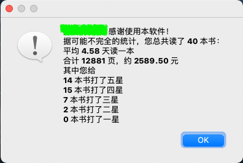

# DoubanBookCovers

制作豆瓣读书封面墙，并展示简单的统计数据。

# Download

下载链接：[Mac](https://github.com/astroboylrx/DoubanBookCovers/releases/download/v1.3/DoubanBookCovers-Mac.app.zip)
~~下载链接：[Windows ](https://github.com/astroboylrx/DoubanBookCovers/releases/download/v1.3/DoubanBookCovers-Windows.zip)~~ (最新版尚未适配Windows平台)

# Usage (用法)

* 当启动它之后，这个app看起来会消失几秒钟（甚至在Dock里也消失）。这时不用担心，稍作等待它就会再出现（我现在也不懂为啥）
* 用户界面如下

* 用户id在你的豆瓣个人主页网址中，在people后面：https://www.douban.com/people/user_id_here/
* 填写用户id，按原有格式填好日期，选择想要的封面墙列数，即可点点击“生成”按钮开始程序；勾选生成评分、页数等数据的话总体会需要更长的时间

* **注意：**由于豆瓣对于API的限制，目前没有什么好的办法可以让程序直接抓取豆瓣读书的用户内容。所以新版的DoubanBookCover（目前只有Mac版）利用了`AppleScript`来控制Safari浏览器访问豆瓣读书的页面，并保存页面源码进行分析和数据收集。所以在第一次运行它时，系统会发出通知说："DoubanBookCovers.app" wants access to control "Safari.app"。届时还请允许它控制Safari，不然它没法继续运行下去。如若不小心选择了不允许，可以到System Preferences里面的Security & Privacy的Privacy这一栏中，在左侧找到Automation，在右侧找到DoubanBookCovers然后勾选Safari来赋予它权限（如下图所示）。

    

## 封面墙样例

点击生成按钮后，程序在获取数据后会弹出保存图片对话框。图片示例如下

## 统计结果

保存封面墙之后，会弹出保存月度阅读统计图片的对话框。图片示例如下

最后如果勾选了“生成评分、页数等统计数据”，则会显示总页数，估计的价格和评分分布

